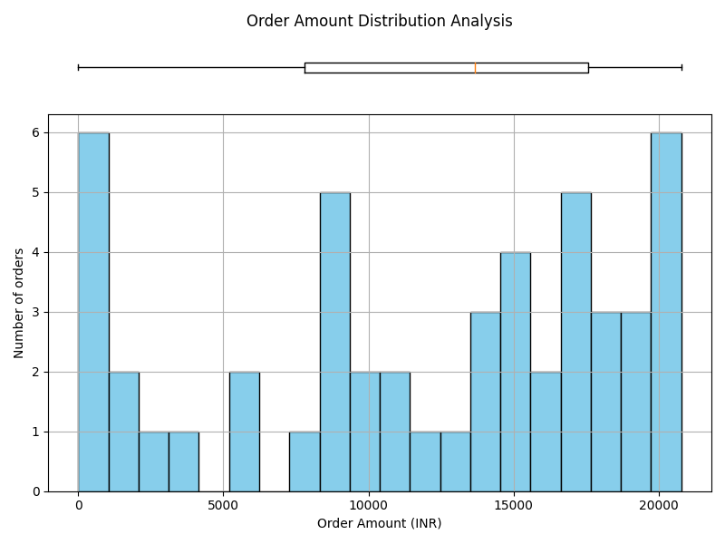

# 📊 Data Quality Summary Report

**Project:** Sales Data Validation Pipeline
**Report Type:** Data Integrity Check
**Generated On:** *Automatically Generated by Python Script*

---

# 📌 Dataset Overview

This validation script runs basic structural and health checks over the primary source files to flag null records, format tracking errors, and duplicate entries.

The process guarantees data completeness before passing variables onto production metrics engines.

---

# ⚙️ Core Structure Profile

| Structural Component   | Value Metrics   |
|------------------------|-----------------|
| Total Data Rows        | 50 Records      |
| Total Columns Count    | 11 Columns      |
| Duplicate Rows Found   | 0 Matches       |

---

# 🔍 Complete Attribute Quality Matrix

| Attribute Name   | Storage Type   | Missing Records (Null %)   |   Unique Entries | Integrity Status   |
|------------------|----------------|----------------------------|------------------|--------------------|
| OrderID          | int64          | 0 (0.0%)                   |               50 | Pass               |
| CustomerID       | object         | 0 (0.0%)                   |               10 | Pass               |
| Salary           | int64          | 0 (0.0%)                   |               50 | Pass               |
| OrderDate        | object         | 0 (0.0%)                   |               37 | Pass               |
| Category         | object         | 0 (0.0%)                   |                5 | Pass               |
| Quantity         | int64          | 0 (0.0%)                   |                5 | Pass               |
| Amount_INR       | float64        | 5 (10.0%)                  |               45 | Fix Needed         |
| Discount         | int64          | 0 (0.0%)                   |                5 | Pass               |
| Final Amount     | float64        | 5 (10.0%)                  |               45 | Fix Needed         |
| Payment Mode     | object         | 0 (0.0%)                   |                3 | Pass               |
| Location         | object         | 0 (0.0%)                   |                5 | Pass               |

---

# 📊 Detailed Integrity Findings

## 1. Null Record Anomalies

| Data Category   | Logged Finding                                                          | Operational Action Item                                                          |
|-----------------|-------------------------------------------------------------------------|----------------------------------------------------------------------------------|
| Missing Prices  | Amount_INR contains missing structural lines (NaN / Null discovered).   | Implement fallback calculation using baseline quantity and price multipliers.    |
| Missing Totals  | Final Amount contains uncalculated empty lines (NaN / Null discovered). | Deploy patch script using price and discount formulas to backfill blank records. |

### 📉 Missing Values & Data Skew Visualization
Below is the data distribution chart highlighting areas affected by missing ticket rows:

---

## 2. Row Duplicate Check

| Metrics Metric   | Scan Finding                          | Operational Action Item                                                   |
|------------------|---------------------------------------|---------------------------------------------------------------------------|
| Record Overlap   | Found 0 duplicated transaction items. | Deduplicate dataset profiles before triggering final financial pipelines. |

---

# 💡 Strategic Quality Remediation Steps

| Validation Phase                 | Identified Risk Factor                              | Mandatory Data Correction                                                   |
|----------------------------------|-----------------------------------------------------|-----------------------------------------------------------------------------|
| **Step 1 - Structural Backfill** | Blank records introduce aggregation skew.           | Fill missing numeric variables using formula rows or remove records safely. |
| **Step 2 - Format Alignment**    | Date sequences might drop string tags.              | Format all timeline stamps strictly into unified pandas timestamp matrices. |
| **Step 3 - Deduplication Drop**  | Duplicate items artificially inflates gross values. | Run drop duplicates method across unique identifier combinations.           |

---

# 📁 Verification Meta Context

| Configuration Item | Environment Value |
| ------------------ | ----------------- |
| Source Document    | Sales.csv         |
| Engine Language    | Python Script     |
| Pipeline Library   | Pandas            |
| Profile Target     | Markdown (.md)    |

---

**End of Quality Report**